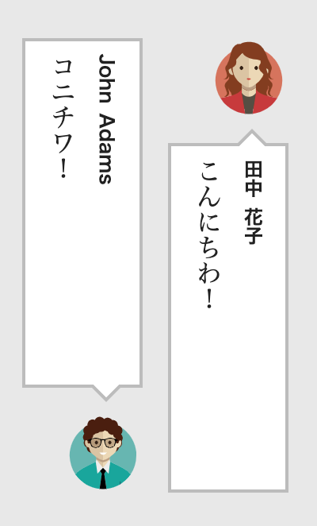

# Semantic Novel

`SemanticNovel` is markup format for [TypeNovel](https://github.com/tategakibunko/TypeNovel) to write novel with plenty of semantic context informations.

## Supported Application

- [TypeNovelReader](https://github.com/tategakibunko/TypeNovelReader)

## Preface

- Every semantic value that **is** `'?'` is not validated by TypeNovel compiler and treated as `undefined` value in reader app.

```javascript
@scene({
  time: '?' // time is ambigous and secret to reader app.
}){
  // time is not annotated in body field, but it's not an error.
}
```

- Every semantic value **starts with** `'?'` is validated by TypeNovel compiler but treated as `undefined` value in reader app.

```javascript
@scene({
  time: '?23:30' // time is 23:30, but keep it secret to reader app.
}){
  // Time constraint must be annotated in body field, otherwise it's an error.
  $time("The night") has come.
}
```

This is usefull when you want to annotate some constraint, but keep the value ambigous to readers or ui of reader app.

Note that constraint value `'?'` in TypeNovel is not validation target of annotation, but constraint value that starts with '?'(like `?23:00`) is validation target of annotation.

<!----------------------------------------------------->

## Markup

You can see all markup definition in `DefaultTnConfig` in [settings.ts](https://github.com/tategakibunko/TypeNovel/blob/master/src/settings.ts).

### @scene

`@scens(<constraints>){ <scene-body> }`


Markup to write some scene with some constraints.

```javascript
@scene({
  place: "Japan",
  season: "summer"
}){
  @scene({
    date: "8/1"
  }){
    @scene({
      time: "9:00"
    }){
       $time("good morning!")
    }
    @scene({
      time: "12:00"
    }){
       $time("lunch time!")
    }
    @scene({
      time: "22:00"
    }){
       $time("good night!")
    }
  } // date:"8/1"
} // place:"Japan", season:"summer"
```

#### constraints

##### time

value: `'00:00'` - `23:00`

```javascript
@scene({time:"09:00"}){ $time() }
```

##### season

value: `spring` | `summer` | `autumn` | `winter`

```javascript
@scene({season:"summer"}){ $time() }
```

##### date

value: `01/01` - `12/31`

<!----------------------------------------------------->


### @speak

`@speak(<character-key>){ <speech-text-body> }`

Markup for writing speech text.

`character-key` must be defined in `data.json`(See **External Data Scheme** section).

```javascript
@speak('Michael Jackson'){ This is it! }
```

In TypeNovelReader, this is displayed like this.


### @sb-start, @sb-end

`@sb-start(<character-key>, <image-key>){ <speech-text-body> }`

Markup for writing speech text with speech-bubble and avatar image.

`character-key` and `image-key` must be defined in `data.json`(See **External Data Scheme** section).

`@sb-start` is displayed by [avatar, speech-bubble] order.

`@sb-end` is displayed by [speech-bubble, avatar] order.

```javascript
@sb-start('Michael', 'excited'){ FOOooOOOoo!! }
@sb-end('Jackson', 'crazy'){ Poooooooo!! }
```

In TypeNovelReader, this is displayed like this.



### @tip

Markup to write some `tip` content.

```javascript
@tip("IMO"){ Abbreviation of 'In My Opinion' }, it's correct.
```

<!----------------------------------------------------->

### @notes

Markup to write some `notes`(footnote) content.

```javascript
This game is inspired by "街" @notes(){ 1998 Chunsoft.inc }
```

<!----------------------------------------------------->

### $ruby

Inline markup to write `ruby` in CJK text.

```javascript
$ruby("漢字", "かんじ")
```

<!----------------------------------------------------->

### $tcy

Inline markup to write `tate-chu-yoko` in `vertical` writing-mode.

```javascript
あのソフトは$tcy("UI")が素晴らしい。
```

<!----------------------------------------------------->

## External Data Schema

External data is stored as `data.json`.

Usually, this data is used by reader app of TypeNovel.

### example

```javascript
{
  "title": "Sample Novel",
  "author": "foo bar",
  "email": "foo@bar.com",
  "homepage": "https://foo.bar.com",
  "writingMode": "vertical-rl",
  "displayTypeNovelError": true,
  "enableSemanticUI": true,
  "speechAvatarSize": 50,
  "characters": {
    "john": {
      "names": ["John", "Adams"],
      "images": {
        "normal": "images/avatar2.svg"
      },
      "description": "Desription of John Adams"
    },
    "taro": {
      "names": ["山田", "太郎"],
      "images": {
        "normal": "images/avatar1.svg"
      },
      "description": "山田太郎の詳細をここに書く"
    }
  }
}
```

### title

Title of the novel.

### auhor

Author of the novel.

### email

Email address of author.

### homepage

Homepage address of author(or novel).

### writingMode

Writing mode of novel. `vertical-rl` or `horizontal-tb` is supported.

### displayTypeNovelError

Whether reader app displays the error of TypeNovel.

### enableSemanticUI

Whether reader app enables semantic info on reader UI.

### speechAvatarSize

Avatar size of `@sb-start` or `@sb-end` tag.

### characters

Characters of novel.

```javascript
  "characters": {
    "john": {
      "names": ["John", "Adams"],
      "images": {
        "normal": "images/avatar2.svg"
      },
      "description": "Desription of John Adams"
    },
    "taro": {
      "names": ["山田", "太郎"],
      "images": {
        "normal": "images/avatar1.svg"
      },
      "description": "山田太郎の詳細をここに書く"
    }
  }
```

#### Schema of each character

##### names

`first name`,` family name` array.

Order is not specified (both [`family name`, ` first name`] and  [`first name`, ` family name`] are OK).

#### description

Description of character.

#### images

Images of character. Each images is referenced by `imageKey`.

For example, image path(`images/avatar1.svg`) is referenced by imageKey(`normal`) in `taro.images`.


